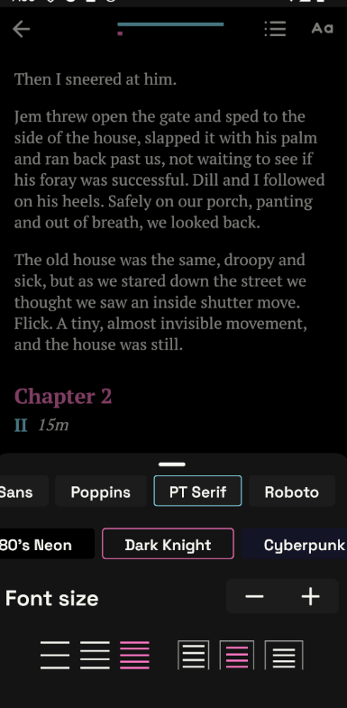
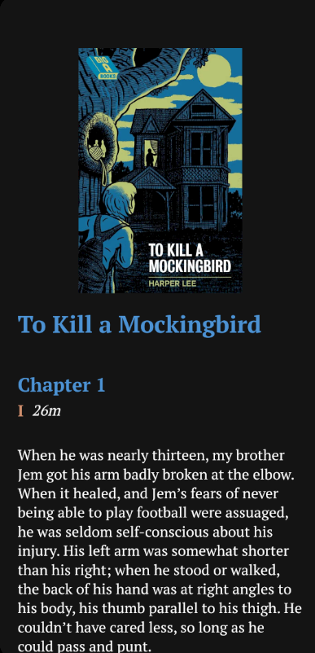
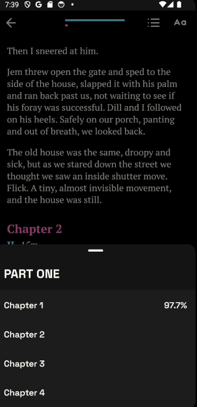
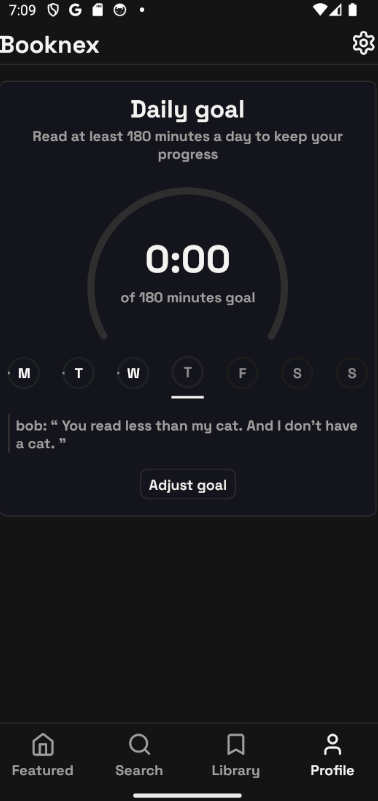
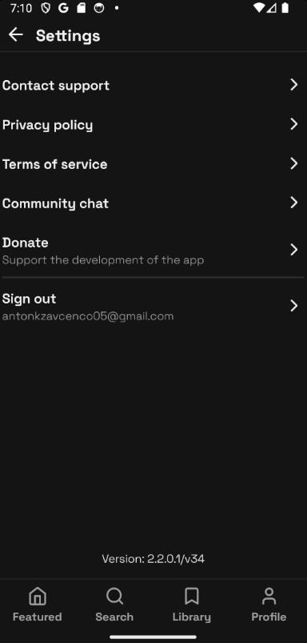
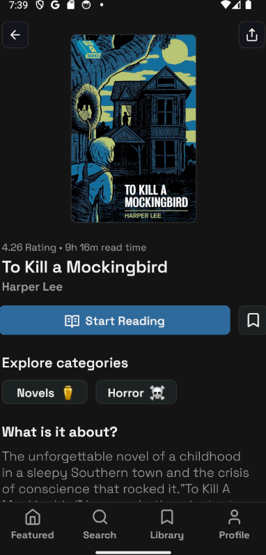
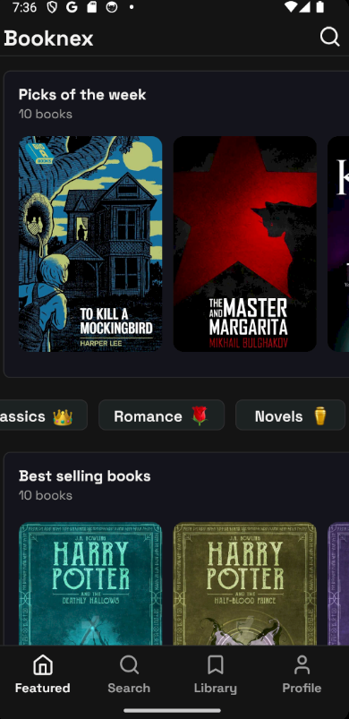
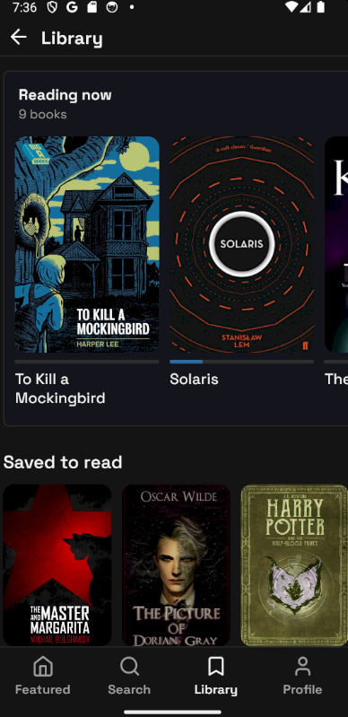

# booknex

### [Demo](https://booknex.up.railway.app/)

## Description
### Booknex is a platform for reading books with a daily reading goal. Build with react-native, nestjs, nextjs and nx monorepo.
### Now the project is on pause. Because there is not enough money to hire a mentor, improve the functionality, publish in store

## Features
- `shadecn` ui library for build dashboard
-  app updating with  `(react-native-code-push)`
-  file storaging with `aws s3`
-  debug problems with `sentry` 🐞
-  global validation and dto with `zod`
-   swagger generate types for backend with `openapi`
-   google, email auth
-   parsing goodreads books with `puppeteer`

-   User daily reading goal tracking
-   book reader with fully customizable (webview) 📖
-   book reading progress tracking
-   best practices in writing code

-  Admin book create with decompose epub
-  tracking book and user statistics
-  fully editable content
-  adaptive design
-  best practices in code architecture

## Screenshots

    
    
    
    
    
    
    
    

