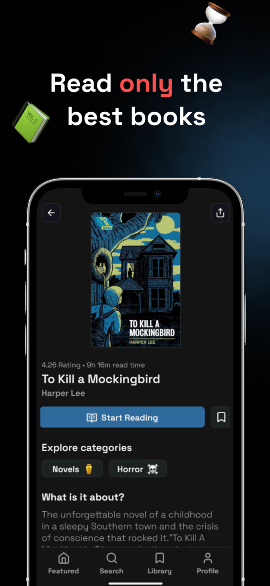
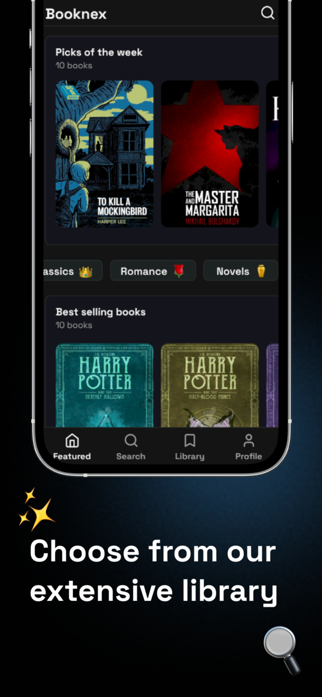
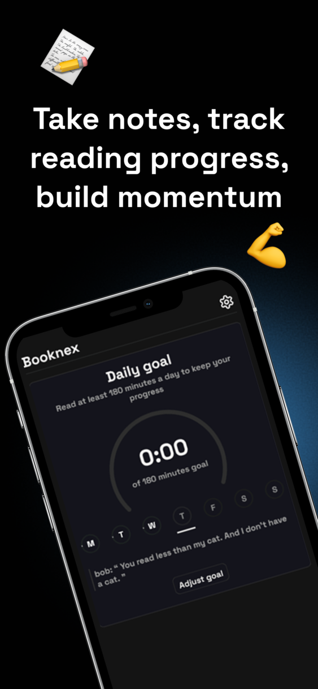
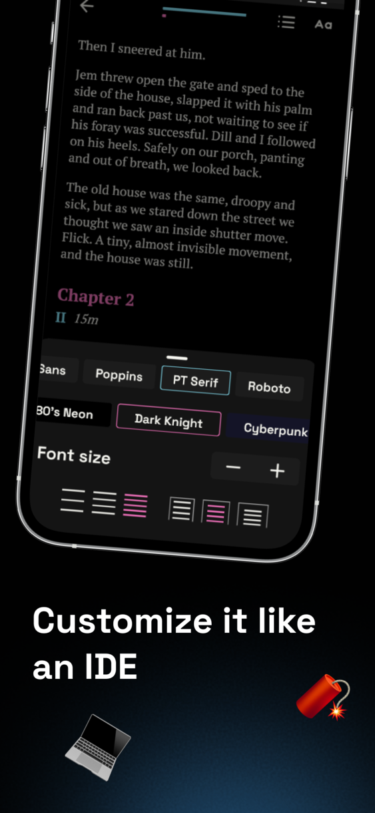

    
    
    
    

  
  

  
  
  

  

  

### 📌 Why I built it?
I wanted a curated collection of truly fundamental books — a small set of works that can shape a person's worldview.  
Existing Android reading apps made it difficult to identify which books were actually worth reading.

---

### ❌ Why It Didn't Work

Most people already read in established apps and have little reason to switch to a new platform.  
The curated model also meant a limited library, while many users prefer to read their own books.